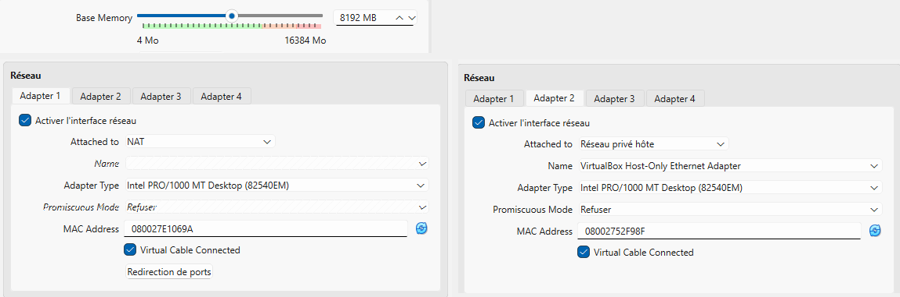
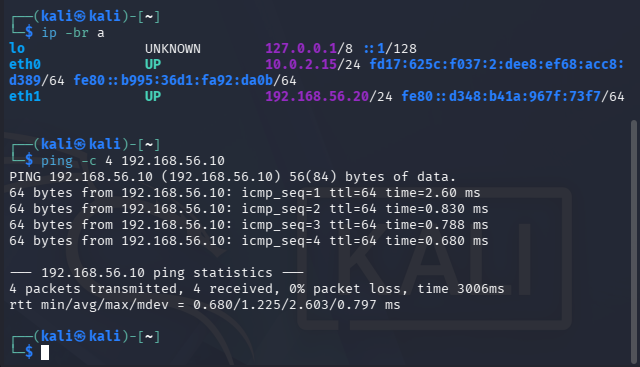
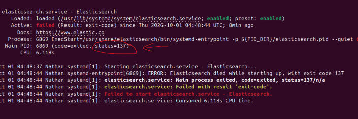
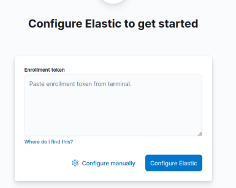

# Installation

Suivre les étapes dans l'ordre.

## 1. Machines virtuelles

Le projet utilise deux machines virtuelles dans VirtualBox :
- **une VM Ubuntu** : le serveur surveillé, avec ses cibles (site web Apache et accès SSH) et tous les outils de détection, de collecte et de visualisation ;
- **une VM Kali** : l'attaquant, utilisée pour lancer les 5 scénarios.

Les deux VM communiquent sur un réseau privé isolé. Les attaques ne sortiront jamais de ce réseau.

### Prérequis
- **VirtualBox 7.2 ou plus récent.** (La version 7.1 ne permet pas d'installer les Additions invité sur le noyau 7.0 d'Ubuntu 24.04.5 (voir « problèmes rencontrés »)).
- L'image **Ubuntu 24.04 LTS Desktop** : "ubuntu-24.04.5-desktop-amd64.iso" (ubuntu.com, rubrique "past releases"). On n'utilise pas Ubuntu 26.04 : trop récente, certains outils risquent de ne pas encore être compatibles donc on ne prend pas de risques.
- L'image **Kali pour VirtualBox** (kali.org, rubrique "Get Kali -> Virtual Machines").
- Un PC avec **16 Go de RAM** recommandés pour faire tourner les deux VM en même temps (moins c'est possible mais cela risque d'être plus long pour certains éléménts).

### Création de la VM Ubuntu
Dans VirtualBox : **Machine -> Nouvelle**, choisir l'ISO Ubuntu, puis les réglages suivants :

| Paramètre | Valeur | Pourquoi |
|---|---|---|
| Skip Unattended Installation | Coché | Garder la main sur l'installation et les droits administrateur |
| Mémoire vive | 8192 Mo | Elasticsearch et Kibana demandent beaucoup de mémoire |
| Processeurs | 4 | Suffisant pour faire tourner tous les outils |
| Disque | 50 Go, non pré-alloué | Le fichier n'occupe que l'espace réellement utilisé |
| Carte réseau 1 | NAT | Accès à Internet pour les téléchargements |
| Carte réseau 2 | Réseau privé hôte | Réseau isolé entre Ubuntu et Kali qui utilisé pour les attaques |



Installation d'Ubuntu : "installer Ubuntu" -> installation interactive -> sélection par défaut -> "effacer le disque et installer Ubuntu" (cela n'efface que le disque virtuel de la VM).

### Mise à jour du système
```bash
sudo apt update && sudo apt upgrade -y
```
Si Ubuntu propose ensuite de passer à la version 26.04, il faut refuser
### Additions invité (copier-coller entre Windows et la VM ce qui facilitera la suite pour votre installation)
Menu VirtualBox : **périphériques -> insérer l'image CD des additions invité**, puis dans le terminal :
```bash
sudo apt install -y bzip2 gcc make perl linux-headers-$(uname -r) build-essential dkms
sudo sh /media/$USER/VBox_GAs_*/VBoxLinuxAdditions.run
sudo reboot
```
Enfin : **périphériques -> presse-papier partagé -> bidirectionnel**. Dans le Terminal on peut maintenant coller avec “Ctrl+Maj+V”.

### Import de la VM Kali
1. Extraire l'archive (en ".7z") (clic droit -> extraire tout) dans le dossier où sont rangées les VM.
2. Dans VirtualBox : **machine -> open…**, puis sélectionner le fichier ".vbox" de Kali.
3. Configuration : mémoire vive 2048 Mo, carte réseau 1 en NAT, carte réseau 2 en réseau privé hôte.
4. Démarrer Kali et utiliser les identifiants par défaut : “kali” / “kali”.


### Adresses IP fixes
Par défaut, la carte « Réseau privé hôte » reçoit une adresse automatique qui peut changer. On fixe l'adresse de chaque VM pour que Kali sache toujours où se trouve sa cible. On repère d'abord la carte et le nom de sa connexion :
```bash
ip -br a
nmcli con show
```
Sur **Ubuntu** (carte "enp0s8", connexion "netplan-enp0s8") :
```bash
sudo nmcli con mod "netplan-enp0s8" ipv4.addresses 192.168.56.10/24 ipv4.method manual
sudo nmcli con up "netplan-enp0s8"
```
Sur **Kali** (carte "eth1", connexion "Wired connection 2") :
```bash
sudo nmcli con mod "Wired connection 2" ipv4.addresses 192.168.56.20/24 ipv4.method manual
sudo nmcli con up "Wired connection 2"
```
La carte NAT ("enp0s3" / "eth0") n'est pas modifiée : elle sert à l'accès Internet.

### Test de communication
Depuis Kali :
```bash
ping -c 4 192.168.56.10
```
Résultat obtenu : 4 paquets envoyés, 4 reçus, 0 % de perte. Les deux VM communiquent.




## 2. Elasticsearch et Kibana 

**1 : Mise à jour de la machine**
```bash
sudo apt update && sudo apt upgrade -y
```

**2 : Autoriser l'installation**
```bash
sudo apt install curl apt-transport-https -y
curl -fsSL https://artifacts.elastic.co/GPG-KEY-elasticsearch | sudo gpg --dearmor -o /usr/share/keyrings/elastic.gpg
```

**3 : Ajout du dépôt Elastic**
```bash
echo "deb [signed-by=/usr/share/keyrings/elastic.gpg] https://artifacts.elastic.co/packages/8.x/apt stable main" | sudo tee /etc/apt/sources.list.d/elastic-8.x.list
```

**4 : Installation de Kibana et Elasticsearch**
```bash
sudo apt update
sudo apt install elasticsearch kibana -y
```

**5 : Démarrer les services**
```bash
sudo systemctl daemon-reload
sudo systemctl enable --now elasticsearch
sudo systemctl enable --now kibana
```

**6 : Vérification si Elastic est actif**
```bash
sudo systemctl status elasticsearch.service
```

Si Elastic ne se lance pas, possible erreur avec la RAM (status = 137).



Alors copier ces commandes (on limite l'utilisation de la RAM à 512 Mo car il consomme beaucoup sinon) :
```bash
echo "-Xms512m" | sudo tee /etc/elasticsearch/jvm.options.d/heap.options
echo "-Xmx512m" | sudo tee -a /etc/elasticsearch/jvm.options.d/heap.options
```

Il faut alors relancer Elastic avec la commande :
```bash
sudo systemctl restart elasticsearch
```

**7 : Configurer la connexion à Elastic**
Lien web vers Elastic : `http://localhost:5601`

Vous arrivez ici : 



Commande pour générer le token d'enrôlement (expire en 30 minutes, à refaire en utilisant la même commande) :
```bash
sudo /usr/share/elasticsearch/bin/elasticsearch-create-enrollment-token -s kibana
```

Pour avoir le code de vérification, utiliser cette commande :
```bash
sudo /usr/share/kibana/bin/kibana-verification-code
```

Commande pour générer le mot de passe du compte admin elastic (à garder précieusement) :
```bash
sudo /usr/share/elasticsearch/bin/elasticsearch-reset-password -u elastic
```

Les identifiants du compte sont donc :
* **Username** : `elastic`
* **Password** : *(mdp généré par la commande)*


## 3. Snort

**1 : Vérifier la disponibilité du paquet**
```bash
apt-cache policy snort
```
Si une ligne « Candidat : 2.9… » apparaît, Snort s'installe en une seule commande.

**2 : Installation**
```bash
sudo apt install snort -y
```
Pendant l'installation, deux questions sont posées :
- Interface réseau à surveiller : `enp0s8` (la carte du réseau privé hôte, celle
  utilisée pour les attaques, pas `enp0s3`, qui est la carte NAT utilisée
  uniquement pour l'accès Internet).
- Adresse du réseau local (HOME_NET) : `192.168.56.0/24`.

**3 : Vérifier/corriger la configuration**
```bash
sudo grep DEBIAN_SNORT /etc/snort/snort.debian.conf
```
Le résultat attendu :

DEBIAN_SNORT_STARTUP="boot"
DEBIAN_SNORT_HOME_NET="192.168.56.0/24"
DEBIAN_SNORT_OPTIONS=""
DEBIAN_SNORT_INTERFACE="enp0s8"
DEBIAN_SNORT_SEND_STATS="true"

Si `DEBIAN_SNORT_INTERFACE` contient plusieurs interfaces (ex. `"enp0s3 enp0s8"`),
la corriger pour ne garder que `enp0s8` :
```bash
sudo sed -i 's/^DEBIAN_SNORT_INTERFACE=.*/DEBIAN_SNORT_INTERFACE="enp0s8"/' /etc/snort/snort.debian.conf
```

**4 : Valider la configuration**
```bash
sudo snort -T -c /etc/snort/snort.conf -i enp0s8
```
Le message final attendu est « Snort successfully validated the configuration! ».

**5 : Ajouter les règles de détection des 5 scénarios**

```bash
echo 'alert tcp any any -> $HOME_NET any (msg:"SCAN Possible nmap scan detecte"; flags:S; threshold: type threshold, track by_src, count 5, seconds 3; sid:1000002; rev:1;)' | sudo tee -a /etc/snort/rules/local.rules
```
Détecte les paquets SYN (`flags:S`, premier paquet d'une connexion TCP) : au-delà
de 5 en 3 secondes depuis la même source (`threshold`), c'est un balayage de
ports plutôt qu'une navigation normale.

```bash
echo 'alert tcp any any -> $HOME_NET 22 (msg:"SSH Brute Force attempt"; flow:to_server,established; threshold: type threshold, track by_src, count 5, seconds 10; sid:1000003; rev:1;)' | sudo tee -a /etc/snort/rules/local.rules
```
Cible uniquement le port SSH (22) et les connexions réellement établies
(`flow:to_server,established`). Seuil de 5 tentatives en 10 secondes : une
succession rapide d'authentifications trahit un outil comme hydra.

```bash
echo 'alert tcp any any -> $HOME_NET 80 (msg:"SQL Injection attempt detecte"; content:"UNION"; nocase; http_uri; sid:1000004; rev:1;)' | sudo tee -a /etc/snort/rules/local.rules
```
Cherche le mot-clé `UNION` dans l'URL des requêtes HTTP (`http_uri`), sans
tenir compte de la casse (`nocase`). Une seule occurrence suffit à déclencher
l'alerte, pas besoin de seuil.

```bash
echo 'alert tcp any any -> $HOME_NET 80 (msg:"XSS attempt detecte"; content:"<script"; nocase; http_uri; sid:1000005; rev:1;)' | sudo tee -a /etc/snort/rules/local.rules
```
Même logique que l'injection SQL, mais recherche la balise `<script` dans l'URL :
signature typique d'une tentative d'injection de code côté navigateur.

```bash
echo 'alert tcp any any -> $HOME_NET 80 (msg:"Directory Traversal attempt detecte"; content:"../"; http_uri; sid:1000006; rev:1;)' | sudo tee -a /etc/snort/rules/local.rules
```
Recherche le motif `../` dans l'URL, utilisé pour remonter hors du dossier web
et accéder à des fichiers du système normalement inaccessibles.

```bash
echo 'alert tcp any any -> $HOME_NET any (msg:"DOS SYN Flood attempt detecte"; flags:S; threshold: type threshold, track by_src, count 50, seconds 2; sid:1000007; rev:1;)' | sudo tee -a /etc/snort/rules/local.rules
```
Même principe que la règle de scan, mais avec un seuil bien plus élevé (50 paquets
SYN en 2 secondes) : ce volume distingue une inondation visant à saturer le
serveur d'un simple scan de ports.

Les `sid` (identifiants de règle) commencent à 1000002 : les valeurs en dessous
de 1 000 000 sont réservées aux règles officielles de Snort, celles au-dessus
sont libres pour nos règles personnalisées.

**6 : Démarrer et vérifier le service**
```bash
sudo systemctl restart snort
sudo systemctl status snort
```
Le statut doit afficher `active (running)`.

**7 : Lancer Snort en mode console pour les tests et captures**
```bash
sudo snort -A fast -q -c /etc/snort/snort.conf -i enp0s8 -l /var/log/snort
```
Ce mode écrit les alertes à la fois à l'écran et dans `/var/log/snort/alert`
(fichier lu ensuite par syslog-ng pour l'envoi vers Elasticsearch).

**8 : Remettre le service en fonctionnement normal**
```bash
sudo systemctl start snort
```

## Problèmes rencontrés et solutions

| Problème | Solution |
|---|---|
| `grep: /etc/snort/snort.debian.conf: Permission denied` | Le fichier n'est lisible que par root : ajouter `sudo` devant la commande. |
| Les alertes DVWA (XSS, injection SQL) ne se déclenchent pas en testant depuis le navigateur d'Ubuntu | Le trafic local (`localhost`) ne passe jamais par l'interface réseau `enp0s8` surveillée par Snort. Toujours tester en visant `192.168.56.102` depuis la VM Kali. |
| `Ctrl+C` ne stoppe pas immédiatement Snort en mode console | Snort attend qu'un paquet arrive sur l'interface pour traiter le signal d'arrêt. Générer un peu de trafic (ping, navigation) ou utiliser `sudo pkill snort` depuis un second terminal. |

## 4. syslog-ng

**1. Installation des paquets**

```bash
sudo apt update && sudo apt install openssh-server apache2 syslog-ng -y
```

**2. Ajout de la configuration à la fin du fichier syslog-ng.conf**

```bash
sudo nano /etc/syslog-ng/syslog-ng.conf
```
A rajouter à la fin du fichier : 

```bash
source s_ssh { file("/var/log/auth.log"); };
source s_web { file("/var/log/apache2/access.log" flags(no-parse)); };
source s_snort { file("/var/log/snort/alert" flags(no-parse)); };

destination d_elastic {
    elasticsearch-http(
        index("projet-secu-${YEAR}.${MONTH}.${DAY}")
        type("")
        url("https://localhost:9200/_bulk")
        user("elastic")
        password("VOTRE_MOT_DE_PASSE_ELASTIC")
        tls(ca-file("/etc/elasticsearch/certs/http_ca.crt"))
    );
};

log {
    source(s_ssh);
    source(s_web);
    source(s_snort);
    destination(d_elastic);
};
```

**3. Redémarrage du service pour appliquer les changements**

```bash
sudo systemctl restart syslog-ng
```

## 5. Alertes par e-mail


## Problèmes rencontrés et solutions

| Problème | Solution |
|---|---|
| | |
