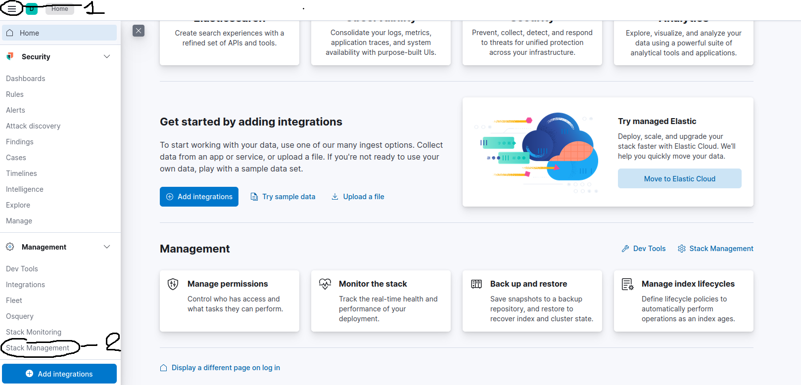
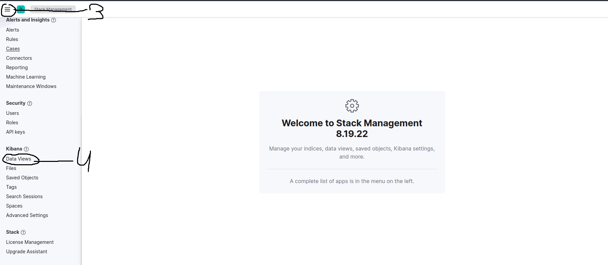
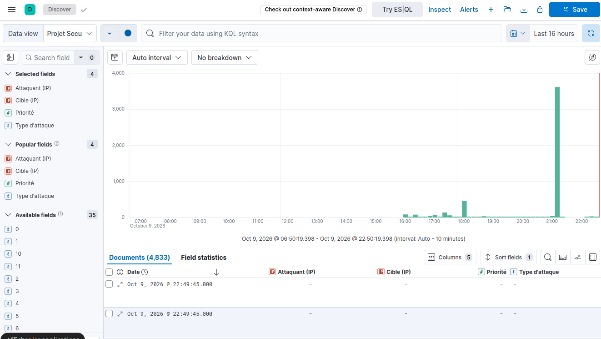
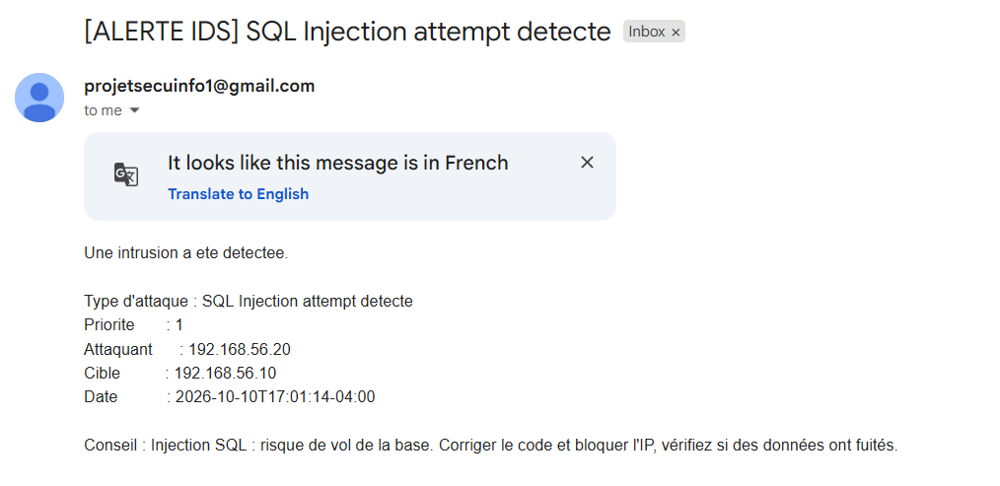

# Installation

Suivre les étapes dans l'ordre.

## 1. Machines virtuelles

Le projet utilise deux machines virtuelles dans VirtualBox :
- **une VM Ubuntu** : le serveur surveillé, avec ses cibles (site web DVWA et accès SSH) et tous les outils de détection, de collecte et de visualisation ;
- **une VM Kali** : l'attaquant, utilisée pour lancer les 5 scénarios. 


Les deux VM communiquent sur un réseau privé isolé. Les attaques ne sortiront jamais de ce réseau.

### Prérequis
- **VirtualBox 7.2 ou plus récent.**
- L'image **[Ubuntu 24.04](https://releases.ubuntu.com/24.04/)** (fichier `ubuntu-24.04.x-desktop-amd64.iso`). On n'utilise pas Ubuntu 26.04 car trop récente certains outils risquent de ne pas encore être compatibles donc on ne prend pas de risque.
- L'image **[Kali Linux pour VirtualBox](https://www.kali.org/get-kali/#kali-virtual-machines)** (choisir le format “Virtual Machines -> VirtualBox“).
- Un PC avec **16 Go de RAM** (recommandé pour pouvoir faire fonctionner de bonne manière les deux VM, en dessous c’est possible mais aussi forcément plus lent).

### Création de la VM Ubuntu
Dans VirtualBox : **Machine -> Nouvelle**, choisir l'ISO Ubuntu, puis les réglages suivants :

| Paramètre | Valeur | Pourquoi |
|---|---|---|
| Skip Unattended Installation | Coché | Garder la main sur l'installation et les droits administrateur |
| Mémoire vive | 8192 Mo | Elasticsearch et Kibana demandent beaucoup de mémoire |
| Processeurs | 4 | Suffisant pour faire tourner tous les outils |
| Disque | 50 Go, non pré-alloué | Le fichier n'occupe que l'espace réellement utilisé |
| Carte réseau 1 | NAT | Accès à Internet pour les téléchargements |
| Carte réseau 2 | Réseau privé hôte | Réseau isolé entre Ubuntu et Kali, utilisé pour les attaques |


Installation d'Ubuntu : "installer Ubuntu" -> installation interactive -> sélection par défaut -> "effacer le disque et installer Ubuntu" (cela n'efface que le disque virtuel de la VM et non le votre).

### Mise à jour du système
```bash
sudo apt update && sudo apt upgrade -y
```
Si Ubuntu propose ensuite de passer à la version 26.04, il faut refuser (important, on n’est jamais sûr de si tout devient incompatible avec une MAJ).

### Additions invité (copier-coller entre Windows et la VM, pas obligatoire mais pratique)
Menu VirtualBox : **périphériques -> insérer l'image CD des additions invité**, puis dans le terminal :
```bash
sudo apt install -y bzip2 gcc make perl linux-headers-$(uname -r) build-essential dkms
sudo sh /media/$USER/VBox_GAs_*/VBoxLinuxAdditions.run
sudo reboot
```
Enfin : **périphériques -> presse-papier partagé -> bidirectionnel**. Dans le Terminal on peut maintenant coller avec "Ctrl+Maj+V".

### Import de la VM Kali
1. Extraire l'archive (en ".7z") (clic droit -> extraire tout) dans le dossier où sont rangées les VM.
2. Dans VirtualBox : **machine -> open…**, puis sélectionner le fichier ".vbox" de Kali.
3. Configuration : mémoire vive 2048 Mo, carte réseau 1 en NAT, carte réseau 2 en réseau privé hôte.
4. Démarrer Kali et utiliser les identifiants par défaut : "kali" / "kali".


### Adresses IP fixes
Par défaut, la carte « Réseau privé hôte » reçoit une adresse automatique qui peut changer. On fixe l'adresse de chaque VM pour que Kali sache toujours où se trouve sa cible. On repère d'abord la carte et le nom de sa connexion :
```bash
ip -br a
nmcli con show
```
Sur **Ubuntu** (carte "enp0s8", connexion "netplan-enp0s8") :
```bash
sudo nmcli con mod "netplan-enp0s8" ipv4.addresses 192.168.56.10/24 ipv4.method manual
sudo nmcli con up "netplan-enp0s8"
```
Sur **Kali** (carte "eth1", connexion "Wired connection 2") :
```bash
sudo nmcli con mod "Wired connection 2" ipv4.addresses 192.168.56.20/24 ipv4.method manual
sudo nmcli con up "Wired connection 2"
```
La carte NAT ("enp0s3" / "eth0") n'est pas modifiée car elle sert à l'accès internet.

### Test de communication
Depuis Kali :
```bash
ping -c 4 192.168.56.10
```
Résultat obtenu : 4 paquets envoyés, 4 reçus, 0 % de perte donc les deux VM communiquent.


## 2. Elasticsearch et Kibana

**1 : Mise à jour de la machine**
```bash
sudo apt update && sudo apt upgrade -y
```

**2 : Autoriser l'installation**
```bash
sudo apt install curl apt-transport-https -y
curl -fsSL https://artifacts.elastic.co/GPG-KEY-elasticsearch | sudo gpg --dearmor -o /usr/share/keyrings/elastic.gpg
```

**3 : Ajout du dépôt Elastic**
```bash
echo "deb [signed-by=/usr/share/keyrings/elastic.gpg] https://artifacts.elastic.co/packages/8.x/apt stable main" | sudo tee /etc/apt/sources.list.d/elastic-8.x.list
```

**4 : Installation de Kibana et Elasticsearch**
```bash
sudo apt update
sudo apt install elasticsearch kibana -y
```

**5 : Limiter la mémoire d'Elasticsearch (avant le premier démarrage)**
Elasticsearch consomme beaucoup de RAM. On la limite pour éviter l'erreur de démarrage (status = 137). Avec une VM à 8 Go, mettre `1g` ; avec moins, mettre `512m` :
```bash
echo "-Xms1g" | sudo tee /etc/elasticsearch/jvm.options.d/heap.options
echo "-Xmx1g" | sudo tee -a /etc/elasticsearch/jvm.options.d/heap.options
```

**6 : Démarrer les services**
```bash
sudo systemctl daemon-reload
sudo systemctl enable --now elasticsearch
sudo systemctl enable --now kibana
```

**7 : Vérifier qu'Elastic est actif**
```bash
sudo systemctl status elasticsearch.service
```
Doit afficher `active (running)`. En cas d'erreur `status = 137`, vérifier l'étape 5 puis `sudo systemctl restart elasticsearch`.


**8 : Configurer la connexion à Elastic**
Lien web vers Elastic : `http://localhost:5601`


Générer le token d'enrôlement (expire en 30 minutes, à refaire avec la même commande si besoin) :
```bash
sudo /usr/share/elasticsearch/bin/elasticsearch-create-enrollment-token -s kibana
```
Obtenir le code de vérification :
```bash
sudo /usr/share/kibana/bin/kibana-verification-code
```
Générer le mot de passe du compte admin elastic (à garder précieusement) :
```bash
sudo /usr/share/elasticsearch/bin/elasticsearch-reset-password -u elastic
```
Identifiants : **Username** `elastic` / **Password** *(généré par la commande)*.


## 3. Snort

**1 : Vérifier la disponibilité du paquet**
```bash
apt-cache policy snort
```
Si une ligne « Candidat : 2.9… » apparaît, Snort s'installe en une seule commande.

**2 : Installation**
```bash
sudo apt install snort -y
```
Pendant l'installation, deux questions peuvent être posées (sinon on les règle à l'étape 3) :
- Interface réseau à surveiller : `enp0s8` (la carte du réseau privé hôte, pas `enp0s3` qui est la carte NAT).
- Adresse du réseau local (HOME_NET) : `192.168.56.0/24`.

**3 : Vérifier / corriger la configuration**
```bash
sudo grep DEBIAN_SNORT /etc/snort/snort.debian.conf
```
Résultat attendu :
```
DEBIAN_SNORT_STARTUP="boot"
DEBIAN_SNORT_HOME_NET="192.168.56.0/24"
DEBIAN_SNORT_INTERFACE="enp0s8"
```
Si `DEBIAN_SNORT_INTERFACE` ne contient pas `enp0s8`, le corriger :
```bash
sudo sed -i 's/^DEBIAN_SNORT_INTERFACE=.*/DEBIAN_SNORT_INTERFACE="enp0s8"/' /etc/snort/snort.debian.conf
```

**4 : Ajouter les règles de détection des 5 scénarios (avec priorités)**
```bash
echo 'alert tcp any any -> $HOME_NET any (msg:"SCAN Possible nmap scan detecte"; flags:S; threshold: type threshold, track by_src, count 5, seconds 3; sid:1000002; rev:1; classtype:attempted-recon; priority:3;)' | sudo tee -a /etc/snort/rules/local.rules
echo 'alert tcp any any -> $HOME_NET 22 (msg:"SSH Brute Force attempt"; flow:to_server,established; threshold: type threshold, track by_src, count 5, seconds 10; sid:1000003; rev:1; classtype:attempted-admin; priority:2;)' | sudo tee -a /etc/snort/rules/local.rules
echo 'alert tcp any any -> $HOME_NET 80 (msg:"SQL Injection attempt detecte"; content:"UNION"; nocase; http_uri; sid:1000004; rev:1; classtype:web-application-attack; priority:1;)' | sudo tee -a /etc/snort/rules/local.rules
echo 'alert tcp any any -> $HOME_NET 80 (msg:"XSS attempt detecte"; content:"<script"; nocase; http_uri; sid:1000005; rev:1; classtype:web-application-attack; priority:2;)' | sudo tee -a /etc/snort/rules/local.rules
echo 'alert tcp any any -> $HOME_NET 80 (msg:"Directory Traversal attempt detecte"; content:"../"; http_uri; sid:1000006; rev:1; classtype:web-application-attack; priority:1;)' | sudo tee -a /etc/snort/rules/local.rules
echo 'alert tcp any any -> $HOME_NET any (msg:"DOS SYN Flood attempt detecte"; flags:S; threshold: type threshold, track by_src, count 50, seconds 2; sid:1000007; rev:1; classtype:attempted-dos; priority:1;)' | sudo tee -a /etc/snort/rules/local.rules
```
Les `sid` commencent à 1000002 : les valeurs sous 1 000 000 sont réservées aux règles officielles de Snort, celles au-dessus sont libres pour nos règles personnalisées. Le détail de chaque règle et des priorités est donné dans les fiches `scenarios/`.

**5 : Valider la configuration**
```bash
sudo snort -T -c /etc/snort/snort.conf -i enp0s8
```
Message attendu : « Snort successfully validated the configuration! ».

**6 : Lancer Snort (mode console)**
C'est ce mode qui écrit dans `/var/log/snort/alert`, le fichier lu par syslog-ng. On arrête d'abord le service pour éviter deux instances sur la même interface :
```bash
sudo systemctl stop snort
sudo snort -A fast -q -c /etc/snort/snort.conf -i enp0s8 -l /var/log/snort
```
Laisser ce terminal ouvert pendant les démonstrations : c'est lui qui alimente la collecte. Le service seul (`systemctl start snort`) écrit dans un autre fichier que syslog-ng ne lit pas.


## 4. Site web cible : DVWA

Ce site est volontairement vulnérable et elle sera notre victime des scénarios 3 (injection SQL) et 4 (XSS / directory traversal).

**1 : Installer Apache, PHP et MariaDB**
```bash
sudo apt install apache2 php libapache2-mod-php php-mysqli php-gd mariadb-server git openssh-server -y
sudo systemctl enable --now apache2 mariadb
```
(OpenSSH est installé ici parce qu’il sert de victime au scénario 2, brute force SSH.)

**2 : Installer DVWA**
```bash
cd /var/www/html
sudo rm -f index.html
sudo git clone https://github.com/digininja/DVWA.git .
sudo chown -R www-data:www-data /var/www/html
sudo chmod -R 755 /var/www/html
```

**3 : Créer la base de données**
```bash
sudo mysql -u root -e "CREATE DATABASE dvwa; CREATE USER 'dvwa'@'localhost' IDENTIFIED BY 'dvwapass'; GRANT ALL ON dvwa.* TO 'dvwa'@'localhost'; FLUSH PRIVILEGES;"
```

**4 : Configurer DVWA**
```bash
sudo cp config/config.inc.php.dist config/config.inc.php
sudo sed -i "s/\$_DVWA\[ 'db_user' \].*/\$_DVWA[ 'db_user' ] = getenv('DB_USER') ?: 'dvwa';/" config/config.inc.php
sudo sed -i "s/\$_DVWA\[ 'db_password' \].*/\$_DVWA[ 'db_password' ] = getenv('DB_PASSWORD') ?: 'dvwapass';/" config/config.inc.php
sudo chown www-data:www-data config/config.inc.php
sudo systemctl restart apache2
```

**5 : Initialiser la base depuis le navigateur**
- Depuis Kali sur Firefox `http://192.168.56.10/setup.php`
- Cliquer sur **Create / Reset Database**.

**6 : Se connecter et régler la sécurité**
- `http://192.168.56.10/login.php`, identifiants `admin` / `password` 
- Menu **DVWA Security** -> **Low** -> **Submit** (à refaire à chaque nouvelle session).

**7 : Créer un compte cible pour le brute force (scénario 2)**
Le scénario 2 attaque un compte SSH volontairement faible. On le crée sur la VM Ubuntu :
```bash
sudo adduser vboxuser
```
Choisir un mot de passe simple (ex. `azerty123`, il faudra le réutiliser pour le scénario 2 cf son fichier prévu) et valider les questions suivantes avec entrée.


## 5. syslog-ng (collecte des logs)

**1 : Installation**
```bash
sudo apt install syslog-ng syslog-ng-mod-http -y
```

**2 : Ajouter la configuration**
À la fin du fichier `/etc/syslog-ng/syslog-ng.conf` (`sudo nano /etc/syslog-ng/syslog-ng.conf`) il faudra ajouter le bloc suivant. Il collecte les logs SSH, les logs web et les alertes Snort, découpe ces alertes en champs (IP, type d'attaque, priorité) et envoie le tout à elasticsearch. Remplacer `VOTRE_MOT_DE_PASSE_ELASTIC` par le mot de passe du compte `elastic` qu’on a pus avoir à l’étape précédente.
```
source s_ssh { file("/var/log/auth.log"); };
source s_web { file("/var/log/apache2/access.log" flags(no-parse)); };
source s_snort { file("/var/log/snort/alert" flags(no-parse)); };

parser p_snort {
    regexp-parser(
        patterns('\[\*\*\] \[(?<gid>\d+):(?<sid>\d+):(?<rev>\d+)\] (?<signature>.*?) \[\*\*\](?: \[Classification: (?<classification>[^\]]*)\])? \[Priority: (?<priority>\d+)\] \{(?<proto>\w+)\} (?<src_ip>[\d.]+)(?::(?<src_port>\d+))? -> (?<dest_ip>[\d.]+)(?::(?<dest_port>\d+))?')
        prefix("snort.")
    );
};

destination d_elastic {
    elasticsearch-http(
        index("projet-secu-${YEAR}.${MONTH}.${DAY}")
        type("")
        url("https://localhost:9200/_bulk")
        user("elastic")
        password("VOTRE_MOT_DE_PASSE_ELASTIC")
        tls(ca-file("/etc/elasticsearch/certs/http_ca.crt"))
        template("$(format-json --scope rfc5424 --scope nv-pairs --exclude DATE --key ISODATE @timestamp=${ISODATE})")
    );
};

log { source(s_ssh); source(s_web); destination(d_elastic); };
log { source(s_snort); parser(p_snort); destination(d_elastic); };
```

**3 : Vérifier et redémarrer**
```bash
sudo syslog-ng --syntax-only
sudo systemctl restart syslog-ng
```
Si rien ne s'affiche à la vérification (hormis des “warning” sans importance car le tout fonctionnera toujours) la configuration est valide.


## 6. Visualisation dans Kibana

**1 : Générer une première donnée**
Depuis Kali, visiter le site (`http://192.168.56.10`) pour que syslog-ng crée l'index du jour dans elasticsearch.

**2 : Forcer le bon type des champs**
Par défaut, Elasticsearch stocke `snort.sid` et `snort.priority` comme du texte, ce qui empêche de filtrer de manière efficace lorsque l’on voudra voir nos attaques (et ainsi séparer les alertes faites par snorts plutôt que les notres). On crée un modèle qui impose les bons types à tous les index du projet. Dans Kibana, il faut cliquer sur les 3 barres -> **Dev Tools** et copier coller ainsi que exécuter :
```json
PUT _index_template/projet-secu
{
  "index_patterns": ["projet-secu-*"],
  "template": {
    "mappings": {
      "properties": {
        "snort.sid":      { "type": "integer" },
        "snort.priority": { "type": "integer" },
        "snort.src_ip":   { "type": "ip" },
        "snort.dest_ip":  { "type": "ip" }
      }
    }
  }
}
```

**3 : Créer la Data View**
Dans Kibana : **Management -> Stack Management -> Data Views -> Create data view** :

- **Name** : `Projet Secu`
- **Index pattern** : `projet-secu-*`
- **Timestamp field** : `@timestamp`




**4 : Renommer les champs (optionnel, pour la lisibilité)**
Dans la Data View `Projet Secu`, éditer les champs (icône crayon) pour leur donner un libellé clair :

| Champ | Libellé |
|---|---|
| `snort.src_ip` | Attaquant (IP) |
| `snort.dest_ip` | Cible (IP) |
| `snort.signature` | Type d'attaque |
| `snort.priority` | Priorité |
| `@timestamp` | Date |  

**5 : Afficher le tableau des attaques (Discover)**
Dans **Discover**, choisir la Data View `Projet Secu`, puis ajouter en colonnes les champs ci-dessus. Pour n'afficher que les vraies attaques (et écarter le bruit réseau)qui sont concernées par nos règles :
```
snort.sid >= 1000002
```



## 7. Alertes par mail

Dans cette partie nous faisons un script python qui surveille Elasticsearch en continu et envoie un e-mail à l'administrateur dès qu'une de nos règles se déclenche, avec un conseil adapté au type d'attaque.

**1 : Préparer le dossier et le certificat**
Le script a besoin du certificat d'Elasticsearch, mais celui d'origine n'est lisible que par root. On en fait une copie accessible :
```bash
mkdir -p ~/alertes
sudo cp /etc/elasticsearch/certs/http_ca.crt ~/alertes/http_ca.crt
sudo chown $USER ~/alertes/http_ca.crt
```

**2 : Créer une adresse Gmail dédiée et un mot de passe d'application**
- Créer un compte Gmail pour le projet (ex. `projetsecuinfo1@gmail.com`).
- Activer la **validation en deux étapes** (Compte Google -> Sécurité).
- Créer un **mot de passe d'application** (rechercher “mots de passe des applications“ dans les réglages du compte) Google vous donne ensuite un code de 16 lettres.

**3 : Créer le fichier de configuration**
```bash
nano ~/alertes/config.py
```
Y mettre (en adaptant les valeurs). Remplacer aussi `VOTRE_UTILISATEUR` par votre nom d'utilisateur Ubuntu :
```python
MAIL_FROM = "projetsecuinfo1@gmail.com"
MAIL_PASSWORD = "le_code_de_16_lettres"
MAIL_TO = "adresse_de_l_admin@exemple.com"
ES_PASSWORD = "le_mot_de_passe_elastic"
ES_CA = "/home/VOTRE_UTILISATEUR/alertes/http_ca.crt"
```

**4 : Créer le script**
```bash
nano ~/alertes/alerte.py
```
Y coller le code disponible dans [config/alerte.py](config/alerte.py) du dépôt. Le script :
- interroge Elasticsearch toutes les 30 secondes ;
- ne garde que nos règles personnalisées (`snort.sid >= 1000002`) ;
- envoie un e-mail par type d'attaque (anti-spam prévu) avec un conseil (de base) adapté.

**5 : Installer la dépendance et lancer**
```bash
pip install requests --break-system-packages
cd ~/alertes && python3 alerte.py
```
Le message “Surveillance demarree…” s'affiche. Laissez ce terminal ouvert car il fait tourner le programme . À la prochaine attaque, l'administrateur reçoit un e-mail détaillant le type d'attaque, l'IP de l'attaquant, la cible, l'heure et la marche à suivre.



(Un avertissement `DeprecationWarning` sur `datetime.utcnow()` peut apparaître mais il sans effet, le script fonctionne et le premier e-mail arrive souvent dans les spams : le marquer “non-spam“ l'adresse du projet).


## Problèmes rencontrés et solutions

| Problème | Solution |
|---|---|
| Les Additions invité ne s'installent pas (« Look at /var/log/vboxadd-setup.log ») | VirtualBox 7.1 trop ancien pour le noyau 7.0 : mettre à jour VirtualBox vers la 7.2, puis réinstaller les Additions. |
| Fenêtre « Mise à niveau vers Ubuntu 26.04 disponible » | Refuser, pour garder Ubuntu 24.04. |
| PC éteint pendant une installation, la VM ne démarre plus (`VERR_SSM_INTEGRITY_DECOMPRESSION`) | Clic droit sur la VM -> « Oublier l'état sauvegardé » puis `sudo dpkg --configure -a` et `sudo apt install -f`. |
| « Impossible de trouver le paquet elasticsearch » | Lancer `sudo apt update` après l'ajout du dépôt Elastic. |
| Elasticsearch ne démarre pas (`status = 137`) | Mémoire insuffisante : limiter la mémoire (section 2, étape 5), puis `sudo systemctl restart elasticsearch`. |
| Le token d'enrôlement est refusé par Kibana | Il expire après 30 minutes : en générer un nouveau avec la même commande. |
| `systemctl is-active ssh` affiche « inactive » | Normal sur Ubuntu 24.04 : vérifier `ssh.socket`, qui doit être « active ». |
| `grep: /etc/snort/snort.debian.conf: Permission denied` | Fichier lisible par root seulement : ajouter `sudo`. |
| L'installation de Snort ne demande pas l'interface | Vérifier `DEBIAN_SNORT_INTERFACE` (section 3, étape 3). En mode console, l'interface est de toute façon précisée avec `-i enp0s8`. |
| Le service `snort` tourne mais syslog-ng ne reçoit rien | Le service écrit dans un autre fichier que `/var/log/snort/alert`. Utiliser le mode console (section 3, étape 6)|
| `Ctrl+C` ne stoppe pas Snort en mode console | Snort attend un paquet pour traiter l'arrêt : générer un peu de trafic, ou `sudo pkill snort` depuis un autre terminal. |
| Les champs `snort.*` n'apparaissent pas dans Kibana | syslog-ng avait envoyé des alertes avant le parser : supprimer l'index (`DELETE projet-secu-AAAA.MM.JJ` dans Dev Tools), supprimer `/var/lib/syslog-ng/syslog-ng.persist`, redémarrer syslog-ng, relancer une attaque. |
| Le filtre Kibana `snort.sid >= 1000002` laissait passer du bruit | Le champ `sid` était du texte, la comparaison numérique ne marchait pas donc il a fallu forcer le type des valeurs pour qu’ils puisse fonctionner| 
| Le mail affiche "Attaque" (donc n'a pas su trouver l'attaque) et "?" au lieu des vraies infos | Les champs sont dans un objet `snort` donc le script lit `donnees.get("snort", {}).get("src_ip")` et pas `donnees.get("snort.src_ip")`. |
