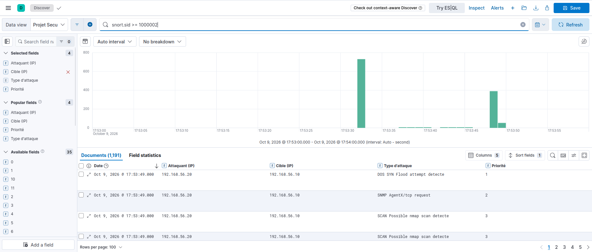
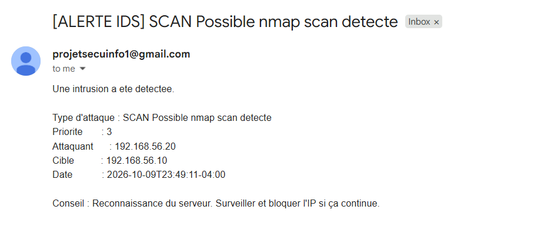

# Scénario 1 : Scan de ports (nmap)

## Description
L'attaquant utilise nmap en mode SYN scan pour sonder les 1000 ports les plus
courants de la cible et déterminer lesquels sont ouverts. C'est une attaque de
reconnaissance : elle ne vole ni ne modifie rien, mais prépare les étapes suivantes.

## Pourquoi ce scénario
Premier réflexe de tout attaquant avant une intrusion (repérage des services
exposés). Permet de montrer que l'IDS détecte une activité de reconnaissance,
pas seulement des attaques déjà abouties.

## Commande lancée (depuis Kali, 192.168.56.103)

nmap -sS 192.168.56.10

## Règle de détection (Snort)

alert tcp any any -> $HOME_NET any (msg:“SCAN Possible nmap scan detecte”; flags:S;
threshold: type threshold, track by_src, count 5, seconds 3; sid:1000002; rev:1;)

Se déclenche dès que 5 paquets SYN ou plus arrivent de la même source en 3 secondes —
signature typique d'un scan de ports.

## Logs collectés (/var/log/snort/alert)

Des dizaines d'alertes similaires apparaissent, une par port scanné.

## Capture Kibana

## E-mail reçu

