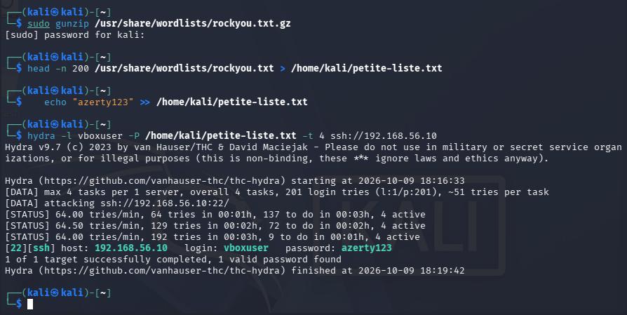
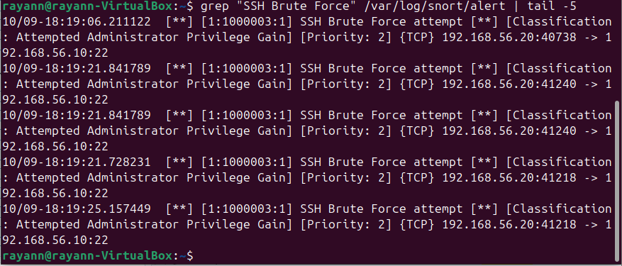
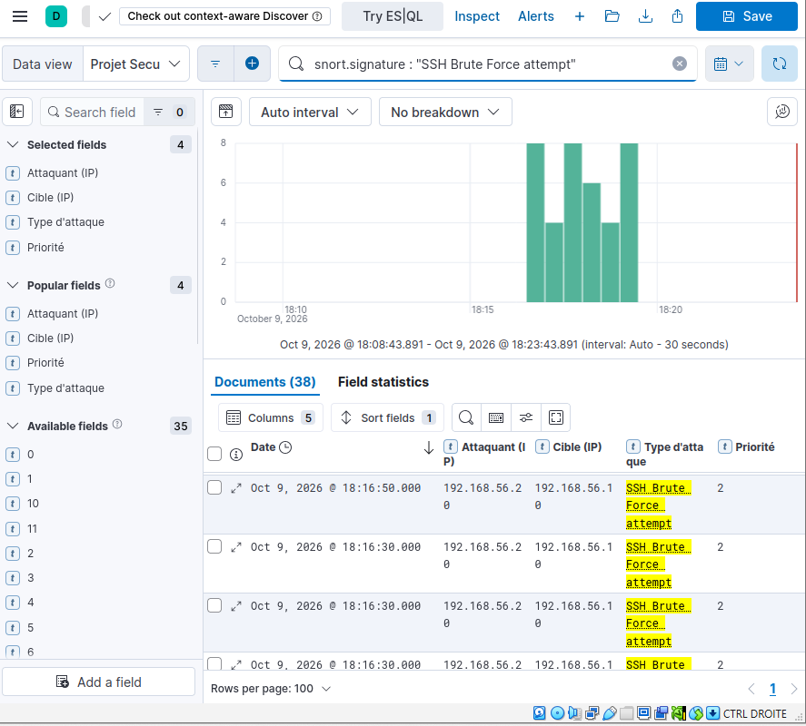

# Scénario 2 : Brute force SSH (hydra)

## Description
L'attaquant teste automatiquement une liste de mots de passe contre le compte
`vboxuser` sur le service SSH (port 22) de la cible, dans l'espoir de deviner le
bon mot de passe et d'obtenir un accès à distance.

## Pourquoi ce scénario
Attaque très répandue contre tout service exposé sur Internet. Montre la capacité
de l'IDS à détecter un grand nombre de tentatives de connexion rapprochées venant
de la même source.

## Commande lancée (depuis Kali)
```bash
head -n 200 /usr/share/wordlists/rockyou.txt > /home/kali/petite-liste.txt
echo "azerty123" >> /home/kali/petite-liste.txt
hydra -l vboxuser -P /home/kali/petite-liste.txt -t 4 ssh://192.168.56.10
```
Si `rockyou.txt` est compressé : `sudo gunzip /usr/share/wordlists/rockyou.txt.gz`.

Hydra finit par trouver le mot de passe, ce qui confirme l'intrusion :



## Règle de détection (Snort)

alert tcp any any -> $HOME_NET 22 (msg:“SSH Brute Force attempt”;
flow:to_server,established; threshold: type threshold, track by_src,
count 5, seconds 10; sid:1000003; rev:1;)

Se déclenche dès que 5 connexions établies ou plus vers le port 22 arrivent de la
même source en 10 secondes.

## Logs collectés (/var/log/snort/alert)

Alerte générée par Snort (`/var/log/snort/alert`) :
```bash
grep "SSH Brute Force" /var/log/snort/alert | tail -5
```


## Capture Kibana
Filtre : `snort.signature : "SSH Brute Force attempt"`



On voit l'attaquant `192.168.56.20` lancer de nombreuses connexions vers la cible `192.168.56.10` sur le port 22, en quelques secondes.

## E-mail reçu
(P4?)
