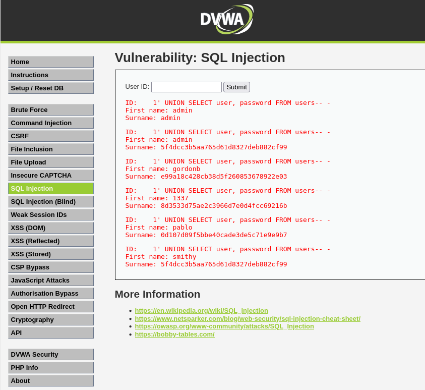
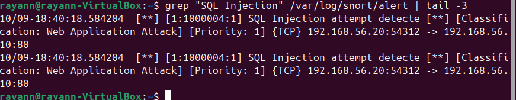
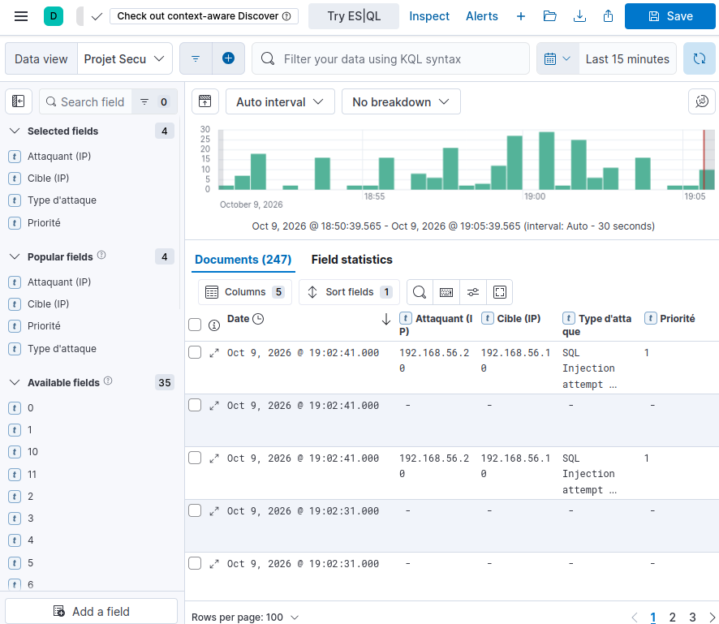

# Scénario 3 : Injection SQL

## Description
L'attaquant exploite un formulaire vulnérable du site web (DVWA) pour injecter du
code SQL dans le champ « User ID ». Avec une requête UNION, il récupère la liste
des utilisateurs et leurs mots de passe hashés directement depuis la base de données.

## Pourquoi ce scénario
C'est l'exemple donné dans l'énoncé du projet. Montre une attaque applicative visant
le vol de données, bien plus dangereuse qu'un scan ou un brute force puisqu'elle
touche directement le contenu de la base.

## Commande lancée (depuis Kali)

Sur DVWA (sécurité réglée sur « Low »), page **SQL Injection**, entrer dans le champ **User ID** :
```
1' UNION SELECT user, password FROM users-- -
```
DVWA renvoie la liste complète des utilisateurs et leurs mots de passe hashés : l'injection a réussi.




## Règle de détection (Snort)

alert tcp any any -> $HOME_NET 80 (msg:“SQL Injection attempt detecte”;
content:“UNION”; nocase; http_uri; sid:1000004; rev:1;)

Se déclenche quand le mot-clé `UNION` apparaît dans l'URL d'une requête HTTP vers le port 80, signature classique d'une injection SQL par UNION. `nocase` ignore la casse, `http_uri` cible la partie URL de la requête.

## Logs collectés (/var/log/snort/alert)
```bash
grep "SQL Injection" /var/log/snort/alert | tail -3
```


Ce log est prioritaire car il contient la requête malveillante exacte, avec l'IP source (192.168.56.20) et la cible (192.168.56.10). Le journal d'Apache (`access.log`) garde également une trace de la requête reçue.

## Résultat dans Kibana
Filtre : `snort.signature : "SQL Injection attempt detecte"`



L'alerte apparaît avec la priorité 1 : une injection SQL réussie permet de lire ou modifier toute la base de données.

## E-mail reçu
(P4?)
