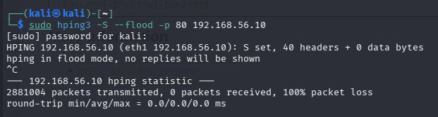
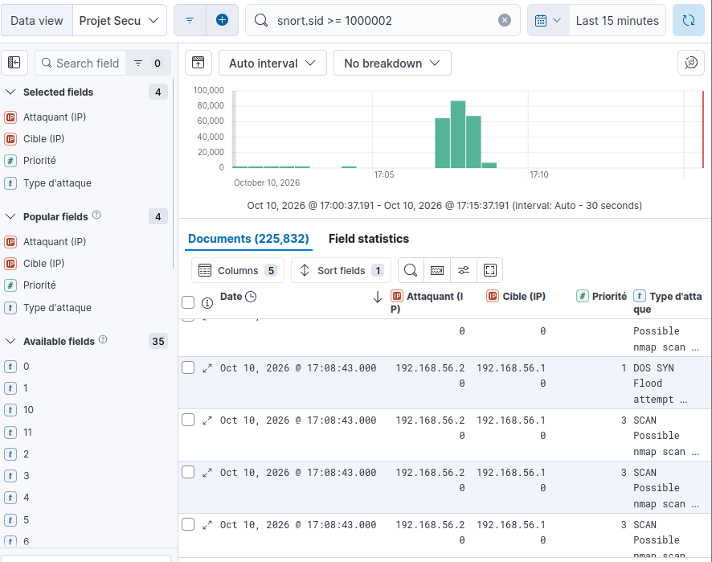
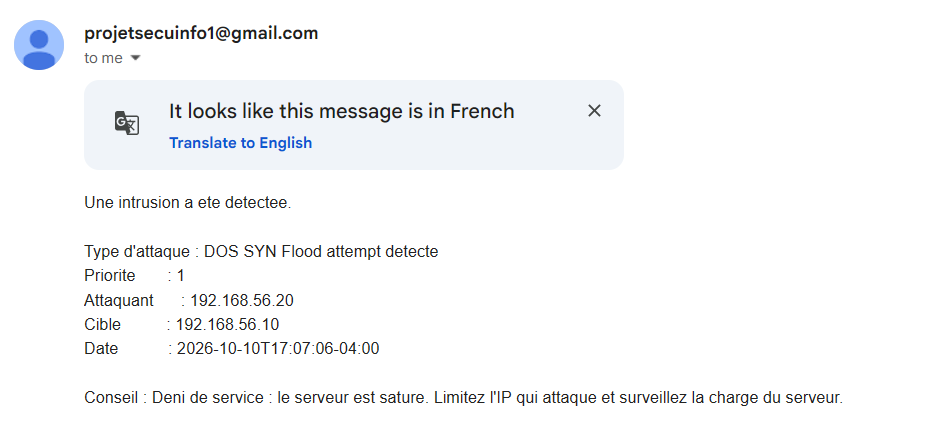

# Scénario 5 : Déni de service SYN flood (hping3)

## Description
L'attaquant envoie un très grand nombre de paquets TCP SYN vers le port 80 du
serveur, sans jamais terminer la connexion. Le serveur sature ses ressources à
essayer de répondre, ce qui peut le rendre inaccessible aux utilisateurs légitimes.

## Pourquoi ce scénario
Seul scénario de disponibilité (les 4 autres visaient la confidentialité ou
l'intégrité). Permet de montrer que l'IDS détecte aussi une attaque par volume,
pas seulement une signature précise dans le contenu des paquets.

## Commande lancée (depuis Kali)

sudo hping3 -S --flood -p 80 192.168.56.10

## Règle de détection (Snort)

alert tcp any any -> $HOME_NET any (msg:“DOS SYN Flood attempt detecte”; flags:S;
threshold: type threshold, track by_src, count 50, seconds 2; sid:1000007; rev:1;)

Seuil plus élevé que la règle de scan (50 paquets SYN en 2 secondes) pour bien
distinguer un flood volumétrique d'un simple scan de ports.

## Logs collectés (/var/log/snort/alert)

Des centaines d'alertes similaires en quelques secondes, une par paquet SYN détecté.

## Capture Kibana

## E-mail reçu

